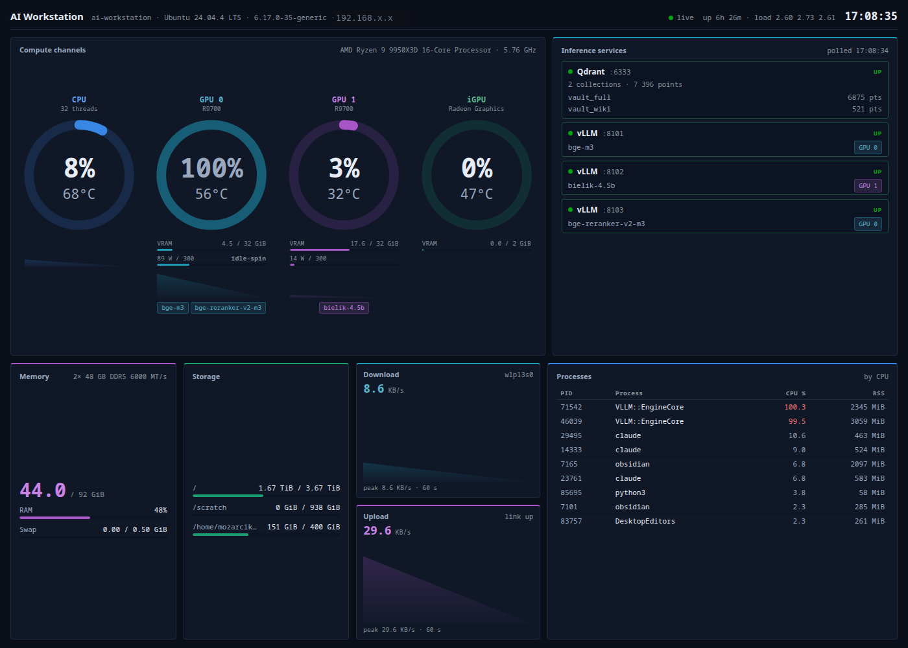

# AI Workstation Dashboard · v1.2.0
System-level monitoring dashboard for local AI/LLM workstations with multi-GPU (ROCm) support.
Built for Ryzen 9 9950X3D + 2× Radeon AI PRO R9700 + Kubuntu 24.04.

## Dashboard Preview
<p align="center">
  
</p>

Real-time system monitoring dashboard for AMD AI workstations.
Built for: Ryzen 9 9950X3D + 2× Radeon AI PRO R9700 + Kubuntu 24.04

Open **http://localhost:8666** in your browser.

> Port note: 8666 is the default. The originally proposed 6666 sits in the
> 6665–6669 IRC range that Chrome/Firefox hard-block (`ERR_UNSAFE_PORT`),
> so the dashboard would be unreachable from a browser on that port.

## Configuration (environment variables)

| Variable         | Default                  | Meaning                          |
|------------------|--------------------------|----------------------------------|
| `DASHBOARD_HOST` | `0.0.0.0`                | Bind address                     |
| `DASHBOARD_PORT` | `8666`                   | HTTP/WS port                     |
| `QDRANT_URL`     | `http://127.0.0.1:6333`  | Qdrant probe base URL            |
| `VLLM_HOST`      | `127.0.0.1`              | Host used when probing vLLM      |
| `VLLM_PORTS`     | *(empty)*                | Extra ports to probe even if no process is running (shown as DOWN). Live `vllm serve` instances are **discovered automatically** — no configuration needed. |

> `start.sh` will auto-run `setup.sh` if the venv doesn't exist yet,
> so you can skip straight to `./start.sh` if you prefer.

## What it monitors

- **Compute channels** — one gauge per unit (CPU, GPU 0, GPU 1, iGPU): utilisation % and temperature inside the ring, a 60 s load trace under it. Each unit owns a hue for life (blue / teal / violet / sea green); crossing a threshold (>75 % or >65 °C → amber, >90 % or >80 °C → red) **overrides** that identity, so a hot card jumps out regardless of whose colour it wears. This is the only place load and temperature appear — nothing repeats them.
- **Model → GPU** — chips under each card name the models actually served on it (several per card supported), and every vLLM row in the services panel carries its own `GPU n` chip. Derived live from `rocm-smi --showpidgpus` with `HIP_VISIBLE_DEVICES` as fallback; unknown assignment shows `GPU ?` rather than a guess.
- **VRAM** — used/total per card with its own memory thresholds (independent of the card's temperature)
- **AI Services** — Qdrant (:6333) collections + point counts; every running vLLM instance, discovered from the process table (no configuration when a new one is started), with status, port, served model and card
- **Network** — download / upload as two cards with 60 s traces, auto-scaled units (B/s → KB/s → MB/s), physical interfaces only (loopback excluded, so local RAG traffic isn't counted as network)
- **Memory / Storage / Processes** — RAM + swap, per-volume usage, top processes by CPU

## Architecture

```
.venv/                     ← isolated Python environment
backend/
  server.py                ← FastAPI + psutil + rocm-smi
  requirements.txt
  frontend/
    index.html             ← self-contained dashboard (no build step)
setup.sh                   ← creates venv, installs deps
start.sh                   ← launches server from venv
ai-dashboard.service       ← systemd unit for autostart
```

## Endpoints

| Endpoint           | Description                        |
|--------------------|------------------------------------|
| `GET /`            | Dashboard UI                       |
| `GET /api/snapshot`| Single JSON snapshot (polling)     |
| `GET /api/services`| AI services health only (Qdrant/vLLM) |
| `WS /ws`           | Real-time stream (1s ticks)        |

## Access from other devices

Server binds to `0.0.0.0:8666` (configurable, see above):

```
- Local: http://localhost:8666
- Network: http://<host-ip>:8666
```

## Autostart with systemd

```bash
sudo cp ai-dashboard.service /etc/systemd/system/
sudo systemctl daemon-reload
sudo systemctl enable --now ai-dashboard

# Check status:
sudo systemctl status ai-dashboard

# View logs:
journalctl -u ai-dashboard -f
```

## Requirements

- Python 3.10+ with `python3-venv`
- `rocm-smi` for GPU metrics (optional — dashboard works without it)

```bash
# If python3-venv is missing:
sudo apt install python3-venv

# For GPU support:
sudo apt install rocm-smi-lib
```

## Updating

```bash
cd ~/ai-dashboard
.venv/bin/pip install --upgrade -r backend/requirements.txt
sudo systemctl restart ai-dashboard   # if using systemd
```

## Changelog

### v1.5.0 — 2026-07-14
- **`GPU use (%)` is no longer trusted as a load signal.** A resident vLLM engine keeps the GPU queue busy and the driver reports 100 % while nothing is computed — so the dashboard was lighting a red "critical" ring on an idle card. Measured on GPU 0 (R9700, 300 W cap, sysfs @0.4 s):

  | state | busy % | power | temp |
  |---|---|---|---|
  | idle-spin (2 engines resident, no requests) | **100 %** | 94–107 W (≤36 % of cap) | 65 °C |
  | real work (parallel bge-m3 embedding burst) | **100 %** | up to 304 W (100 % of cap) | 67 °C |

  busy % read 100 in *both* states — here it carries no information. **Power decides**: a card counts as loaded only when high busy % is backed by ≥50 % of its power cap (`POWER_ACTIVE_FRAC`, placed between the measured idle ceiling 0.36 and real work ≈1.0).
- **Power is now a first-class reading** — watts + share of cap under every ring, with a `working` / `idle-spin` verdict. Idle-spin draws the ring in the channel's own colour, dimmed: an explanation, not an alarm. `use %` is still displayed; only its interpretation changed.
- **Temperature thresholds fixed per part.** The old 65 °C line lit amber on an *idle* 9950X3D (it idles at 60–70 °C on Tctl and throttles ~95 °C) — the same false-alarm class. Now 85 °C elevated / 95 °C critical; heat still escalates on its own, regardless of power.
- Power row hidden on the iGPU, which reports socket power with no cap to normalise against.

### v1.4.0 — 2026-07-14
- **Model → GPU mapping**, derived at runtime, never hard-coded: `rocm-smi --showpidgpus` gives PID → physical card (matched against the `vllm serve` process *and its children* — the parent holds no GPU context, the `VLLM::EngineCore` child does), with `HIP_VISIBLE_DEVICES` from `/proc/<pid>/environ` as fallback. Unknown → `GPU ?`. `rocm-smi --showpids` is deliberately not used: its "GPU(s)" column is a device *count*, not an index.
- **vLLM instances are discovered**, not configured — a new `vllm serve` on any port appears by itself (verified: the reranker on :8103 showed up mid-session with no code change). `VLLM_EMBED_URL` / `VLLM_CHAT_URL` retired in favour of discovery + optional `VLLM_PORTS` seeds. A process that is up but whose API is not answering yet reports `LOADING`.
- **Instrument-panel redesign** (see the design note at the top of `index.html`): compute units become **channels**, each owning a hue the way a patient monitor gives every parameter its own colour. Full palette — 4 channel roles + 2 state roles + 1 status role; every hue has exactly one job. All values in OKLCH, two ink layers per hue (marks ≥3:1, text ≥6.7:1), contrast computed against the real surfaces rather than eyeballed.
- **Cascade bug fixed:** channel hues were applied as *inline* custom properties, which outrank `.chan.critical` — so a card at 100 % / 84 °C stayed teal instead of turning red. Identity now comes from a class; state overrides it.
- VRAM bars carry their own thresholds (a hot card with 14 % VRAM no longer shows a red memory bar).

### v1.3.0 — 2026-07-14
- **Load rings replace the load tables.** Compact donut gauges (CPU, GPU 0, GPU 1, iGPU) carry utilisation + temperature inside the ring; the CPU-temperature panel, the per-GPU cards and the duplicated CPU load/temp fields are gone. One reading, one place.
- **Color as identity + state.** Per-unit hues (blue/teal/purple/sea green), overridden by amber/red on threshold; tinted section cards. Every hue validated with the dataviz `validate_palette.js` against the card surface `#101828` (lightness band, chroma, CVD separation, ≥3:1 contrast).
- **vLLM ×2** — the embedder (:8101, `VLLM_EMBED_URL`) and the generation model (:8102, `VLLM_CHAT_URL`) are probed and reported separately; `VLLM_URL` is retired.
- **Network throughput fixed and restored** — reported in bytes/s (frontend auto-scales the unit) and summed over **physical interfaces only**: the previous version included `lo`, so local RAG traffic (vLLM/Qdrant over 127.0.0.1) inflated the "network" figure. Two small cards with 60 s trend lines.
- Layout fits one screen (1400×1000) without scrolling.

### v1.2.0 — 2026-07-14
- **Port 8000 → 8666**, configurable via `DASHBOARD_PORT` / `DASHBOARD_HOST` (single source of truth in `server.py`; `start.sh`, systemd unit and frontend follow). 6666 rejected: browser-blocked IRC port range.
- **AI Services panel** — Qdrant (collections + point counts) and vLLM (served models) health, `GET /api/services`, 5 s TTL cache, `QDRANT_URL`/`VLLM_URL` overrides.
- **Backend**: blocking collectors (psutil/rocm-smi/urllib) moved off the event loop (`asyncio.to_thread`); shared snapshot cache — N WebSocket clients no longer trigger N× rocm-smi per tick; CORS narrowed to GET.
- **Frontend**: removed Google Fonts CDN (system font stack — fully offline now); WebSocket URL derived from `location.host` instead of hard-coded `:8000`; color as state signal only (utilization thresholds green→amber→red), decorative gradients removed; HTML-escaping of dynamic strings.

### v1.1.1 — 2026-05-26
- **Network panel**: added dedicated TX (upload) 60s line chart in cyan, stacked beneath the RX (download) chart in amber. Both charts auto-scale independently so an idle direction stays readable when the other saturates. Closes the gap where v1.1.0 README promised both directions visible but only RX rendered.

### v1.1.0 — 2026-05-20
- New **Network / Download** panel — RX/TX throughput (MB/s), 60s auto-scaled download line chart, link status (interface, state, negotiated speed). Backend `get_network()` via `psutil.net_io_counters`.

### v1.0.0
- Initial monitoring dashboard — CPU, RAM/Swap, Disk, GPUs (multi-GPU ROCm), top processes, CPU temperature; FastAPI + WebSocket, self-contained frontend.
